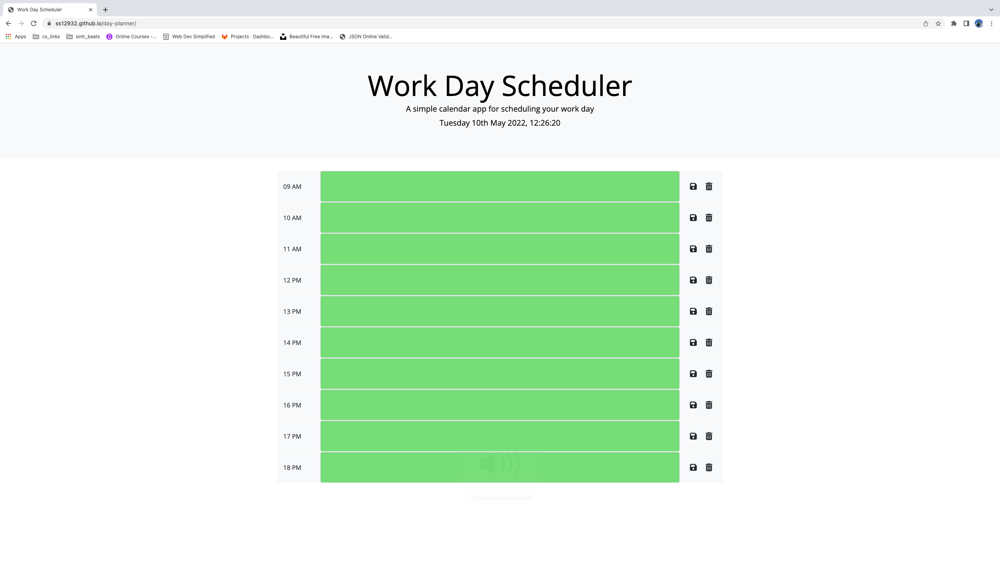

# day-planner

## Overview

This week's assignment is to create a simple calender application that allows a user to save events for standard business hours of 9am-6pm. This app will run in the browser and feature dynamically updated HTML and CSS powered by jQuery.

## Deployed Link

https://ss12932.github.io/day-planner/

## Github Repository Link

https://github.com/ss12932/js-code-quiz

## Application Screenshot



## User Story

```
AS AN employee with a busy schedule
I WANT to add important events to a daily planner
SO THAT I can manage my time effectively

```

## Package

None

## Installation Instructions

None

## License

[](https://opensource.org/licenses/MIT)

## Contact

Please Contact me at ss12932@my.bristol.ac.uk
